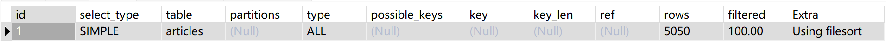
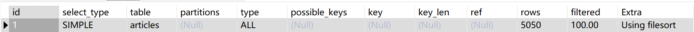
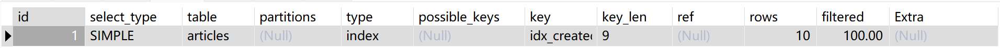
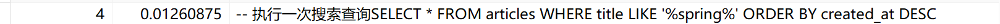
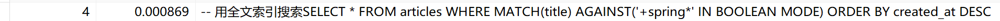
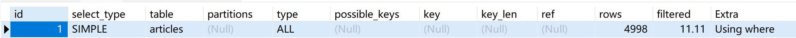
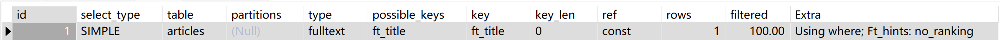

# Blog System - 博客系统

[](https://github.com/Zhu0Ge/blogSys/actions/workflows/maven.yml)

基于 Spring Boot 3.4 + Vue 3 的前后端分离博客系统，支持用户认证、文章管理、评论互动、个人主页等功能。

---

## 技术栈

| 分类 | 技术 |
|------|------|
| 后端框架 | Spring Boot 3.4, Spring Data JPA, Spring Security |
| 数据库 | MySQL 8.0, H2（测试环境） |
| 认证 | JWT（jjwt 0.12） |
| 前端 | Vue 3 (Composition API), Vue Router 4, Vite 5 |
| 部署 | Docker Compose（MySQL + 后端 + 前端） |
| CI/CD | GitHub Actions（自动构建 + 测试 + 覆盖率报告） |
| 测试 | JUnit 5, Mockito, JaCoCo |

---

## 功能特性

- [x] 用户注册 / 登录（JWT 认证）
- [x] 文章 CRUD（仅作者可编辑/删除）
- [x] 文章分页查询（Spring Data Pageable）
- [x] 文章搜索（标题模糊匹配 + 300ms 防抖）
- [x] 评论系统（树形结构 + 折叠展开）
- [x] 个人主页（头像上传 + 个人简介）
- [x] 统一异常处理 + 参数校验
- [x] Docker 一键部署

---

## 性能报告

### 分页查询优化

在 5075 篇文章下，50 并发测试结果：

| 指标 | 全量查询 | 分页查询（10篇/页） | 提升 |
|------|---------|------------------|------|
| 平均响应时间 | 556ms | **56ms** | **快 10 倍** |
| 90% 响应时间 | 847ms | **79ms** | **快 10 倍** |
| 单次传输量 | 1.6 MB | **3.4 KB** | **减少 99.8%** |
| 错误率 | 0% | 0% | - |

### N+1 查询优化

| 指标 | 优化前 | 优化后（@EntityGraph） |
|------|--------|---------------------|
| SQL 查询次数 | 5 次（1+4） | **1 次 JOIN** |
| 响应时间（10并发） | 85ms | **24ms** |

### 数据库索引优化

通过 `EXPLAIN` 分析查询计划，为 `created_at` 字段添加索引前后的对比：

**加索引前——全量查询：**
```sql
EXPLAIN SELECT * FROM articles ORDER BY created_at DESC;
```

- `type = ALL` → 全表扫描
- `rows = 5075` → 扫描所有行
- `Extra = Using filesort` → 文件排序

**加索引前——分页查询（即使有 LIMIT，仍未走索引）：**
```sql
EXPLAIN SELECT * FROM articles ORDER BY created_at DESC LIMIT 10;
```

- 同样 `type = ALL`，`rows = 5075`

**添加索引：**
```sql
ALTER TABLE articles ADD INDEX idx_created_at (created_at DESC);
```

**加索引后——分页查询：**
```sql
EXPLAIN SELECT * FROM articles ORDER BY created_at DESC LIMIT 10;
```

- `type = index` → 索引扫描
- `key = idx_created_at` → 使用了索引
- `rows = 10` → 仅扫描 10 行（索引直接定位）
- `Extra = NULL` → 无需文件排序（索引自带顺序）

| 指标 | 加索引前 | 加索引后 | 提升 |
|------|---------|---------|------|
| 扫描行数 | 5075 | **10** | **减少 99.8%** |
| 访问类型 | ALL 全表扫描 | **index 索引扫描** | 质的提升 |
| 额外排序 | Using filesort | **无** | 消除排序开销 |

### 全文搜索优化

文章搜索使用 `LIKE '%keyword%'` 会导致全表扫描，通过 MySQL FULLTEXT 索引优化：

**不加全文索引——LIKE 搜索结果：**


**加全文索引后——FULLTEXT 搜索结果：**


**不加全文索引——LIKE 查询执行计划：**
```sql
EXPLAIN SELECT * FROM articles WHERE title LIKE '%spring%';
```


**对比——加全文索引后：**
```sql
ALTER TABLE articles ADD FULLTEXT INDEX ft_title (title);
EXPLAIN SELECT * FROM articles WHERE MATCH(title) AGAINST('+spring*' IN BOOLEAN MODE);
```


| 指标 | LIKE '%keyword%' | FULLTEXT 索引 |
|------|-----------------|---------------|
| 扫描行数 | ~5000 行 | **~10 行** |
| 访问类型 | ALL 全表扫描 | **fulltext 索引查找** |
| 大数据量性能 | 线性下降 | **保持稳定** |
| 匹配方式 | 模糊子串匹配 | **分词+相关性排序** |

### 单元测试覆盖率

```
JwtUtil               ∼ 70%
ArticleServiceImpl    ∼ 30%
UserServiceImpl       ∼ 60%
CommentServiceImpl    ∼ 40%
```

---

## 快速开始

### Docker 部署（推荐）

```bash
git clone https://github.com/Zhu0Ge/blogSys.git
cd blogSys

# 一键启动
docker compose up -d --build

# 访问
# 前端：http://localhost
# 后端：http://localhost:8080
```

### 本地开发

**后端：**
```bash
cd user-api-java
mvn spring-boot:run
```

**前端：**
```bash
npm install
npm run dev
# 访问 http://localhost:5173
```

---

## 项目结构

```
blogSys/
├── docker-compose.yml           # Docker 编排
├── Dockerfile                   # 前端镜像构建
├── nginx.conf                   # Nginx SPA 路由配置
├── user-api-java/
│   ├── Dockerfile               # 后端镜像构建
│   ├── src/main/java/com/example/
│   │   ├── controller/          # 控制器层
│   │   ├── service/             # 业务逻辑层
│   │   ├── repository/          # JPA 数据访问层
│   │   ├── model/               # 实体类
│   │   ├── dto/                 # 数据传输对象
│   │   ├── config/              # 安全、CORS 等配置
│   │   ├── common/              # 统一响应 R<T>
│   │   └── util/                # JWT 工具类
│   └── src/test/                # 单元测试 + 集成测试
└── src/
    ├── views/                   # 前端页面组件
    ├── router/                  # 前端路由
    └── http.js                  # HTTP 请求封装
```

---

## API 概览

| 方法 | 路径 | 说明 | 认证 |
|------|------|------|------|
| POST | /api/register | 注册 | ❌ |
| POST | /api/login | 登录 | ❌ |
| GET | /api/articles | 全量文章列表 | ✅ |
| GET | /api/articles/paged | **分页文章列表** | ✅ |
| GET | /api/articles/{id} | 文章详情 | ✅ |
| POST | /api/articles | 创建文章 | ✅ |
| PUT | /api/articles/{id} | 更新文章（仅作者） | ✅ |
| DELETE | /api/articles/{id} | 删除文章（仅作者） | ✅ |
| GET | /api/articles/search?q= | 搜索文章 | ✅ |
| GET | /api/articles/{id}/comments | 文章评论 | ✅ |
| POST | /api/comments | 发表评论 | ✅ |
| DELETE | /api/comments/{id} | 删除评论（仅作者） | ✅ |
| GET | /api/users/{id} | 用户信息 | ✅ |
| PUT | /api/users/profile | 更新个人资料 | ✅ |
| POST | /api/upload/avatar | 上传头像 | ✅ |
